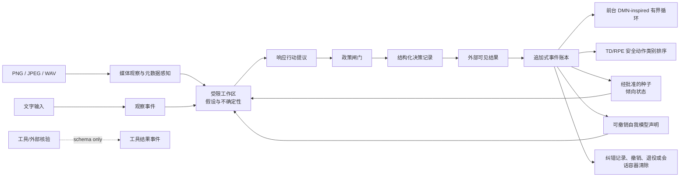

# Strangeloop Agent

一个受瑜伽行派（Yogacara）与《成唯识论》所代表的汉传唯识学启发的、可审计持久 Agent 原型。项目明确研究“自我意识”的**可计算、功能性条件**：持续自我模型、来源归因、反事实预测、反证纠错与多模态输入整合如何被安全地实现和检验。它不试图、也不能用这些功能证明主观体验。唯识术语只提供设计启发，并非一一的软件实现。

**这是对自我意识功能条件的研究，不是主观意识实现声明。** Strangeloop 不具有、也不宣称具有主观体验、感受、欲望、人格、灵魂、固有自我、觉悟或宗教权威。这里的“自我模型”只是对角色、能力、承诺、认识边界与会话连续性的、带证据且可撤销的声明集合。

## 为什么用唯识作启发

项目借用的不是“八个软件模块”的比喻，而是几个工程问题：如何把观察和推断分开、如何使习惯性倾向可追溯、如何避免把暂时叙事当作固定自我，以及如何为未来的反证纠错保留可追溯条件。原义、工程类比和边界见：[RFC-0001](docs/RFC-0001-yogacara-agent.md)、[词汇表](docs/GLOSSARY.md)。

## 当前架构（RFC-0001 MVP + RFC-0002 实验切片）



当前循环记录用户观察、媒体观察、模型行动提议、政策决策、外部可见结果与有界纠错记录，并区分用户、模型、政策与系统来源。账本已定义并可接收独立的 `TOOL_RESULT` schema，供未来工具适配器写入；工具调用与自动载入工作区仍是路线图能力。账本按事件种类使用严格的来源与载荷白名单，只存受控公开摘要、关联 ID、行动和结果，**不存隐藏推理链**。`INFERENCE` 当前禁止持久化，不能成为任意模型文本的通道。

RFC-0002 的实验切片现已实现：PNG/JPEG/WAV 的瞬时只读媒体适配器流、默认仅输出元数据的 `BasicMetadataPerceptor`、显式启动且只由前台调用方驱动的 DMN-inspired 有界循环，以及带外部来源、裁剪和事件记录的 TD/RPE `ValueTable`。它们不调用工具、不自动批准记忆或自我声明，也不绕过 `PolicyGate` 或能力检查。只读流不构成对 adapter 的保密沙箱：自定义 `MediaPerceptor` 是可信宿主边界，能够读取、复制或向外发送内容，也能把最多 512 字符的内容写入 `Percept.summary`；启用前必须审计数据最小化、输出与 egress。

## 快速运行

要求：Python 3.9+。MVP 只使用标准库。

```bash
python3 -m venv .venv
. .venv/bin/activate
python3 -m pip install --upgrade "pip<26" "setuptools>=64"
python3 -m pip install -e .
strangeloop
```

先升级虚拟环境内的安装工具，是为了兼容仍预装旧版 `pip` 的 macOS Python；`pip<26` 同时保留 Python 3.9 支持。

也可以不安装，直接从工作区运行：

```bash
PYTHONPATH=src python3 -m strangeloop.cli
```

默认使用 SQLite `:memory:`，退出即不保留会话数据。持久记忆只使用受控的会话容器根目录：

```bash
strangeloop --memory-root ./strangeloop-memory --session research-001
```

`--memory-root` 为每个会话创建独立、以 session ID 的 SHA-256 命名的 SQLite 容器；文件名不暴露 session ID。旧 `--db` 选项已移除，不是合规的持久化方式。

如需只读本地监视器，可在前台 CLI 会话中启动：

```bash
strangeloop --monitor --monitor-port 0
```

它仅绑定 `127.0.0.1`；端口 `0` 让系统选择一个端口。该页面是公开记录的检查面，不是控制面，不会显示路径、工件原文、prompt、隐藏推理、凭据、原始配额响应或本地 usage ledger。

若用户明确授予一次有时限的研究目标，可启动无人值守的**只读研究**配置：

```bash
strangeloop --memory-root ./strangeloop-memory --session research-001 \
  --monitor --auto-wake --unattended --unattended-goal "比较公开资料中的两个可核验观点"
```

`--unattended` 不是通用命令执行权限。它只允许受预算限制的 `repo.status` / `repo.search` / `repo.read`、无 cookie 的公网 HTTPS `web.fetch`、`web.search` 和 `browser.read`；后两者是无 JavaScript、无登录态的 HTTP 读取，不是交互式浏览器。写文件、测试、shell、上传、登录、购买、发布和私网/localhost 访问均被拒绝。默认情况下，停止、到期、配额休眠或进程重启都会撤销这次临时配置；下述同一前台进程的单次 continuation 是唯一受限例外，且会签发全新的 profile 与 grants，不恢复旧运行。

`--auto-wake` 是单独的、显式的用户授权：CLI 会先写入一条可审计的 `USER AUTO_WAKE_POLICY`，再读取配额。它只允许同一仍在前台运行的进程在 reset 后刷新一次权威 managed-usage，并按结果进入 ready 或保持休眠；它本身不恢复研究。只有 sleep 前另有一条独立的 `USER` one-shot continuation policy，且刷新结果新鲜且权威、CAS 成功、该 policy 未到期时，宿主才会创建全新的只读 profile/runtime policy/grants 并自动运行一次。默认关闭，不能由模型、网页或工具结果启用，退出或重启进程后不会后台唤醒或 continuation。

更积极的多前沿试验使用独立的 `--expedition` 前台模式。下面这份授权最长覆盖五小时（休眠等待也计入），每个切片不超过五分钟、最多四次工具调用，并且只签发 `web.fetch`、`web.search`、`browser.read`；它不会读取仓库、执行 shell、写入文件、登录网站或访问私网：

```bash
strangeloop --memory-root ./strangeloop-memory --session expedition-001 \
  --monitor --monitor-port 0 --auto-wake --expedition \
  --expedition-goal "调查开放式探索、内在动机与质量多样性研究；优先原论文、反证和跨主题联系" \
  --expedition-host-seed "frontier-v1" \
  --expedition-authorization-seconds 18000 \
  --expedition-slice-seconds 300 \
  --expedition-max-calls-per-slice 4
```

远征由宿主在多个固定研究姿态和 frontier 任务之间轮换；K3 的 `respond`、一次空搜索或瞬时失败只结束/退避当前分支，不会自行扩大授权。host seed 只让任务编号与候选平局选择可复查，不保证 K3 逐 token 重放，也不是权限、配额或奖励来源。每次远征授权会绑定目标/seed 摘要和全部预算，并在账本中原子消费一次，不能重放为第二次五小时运行。权威 rolling-5h 余量达到归档阈值时，宿主先写可复算 checkpoint 再进入资源暂停；reset 时间只触发新的权威刷新，刷新确认恢复后才可继续。终端必须保持打开；运行中按 `Ctrl-C` 会走受控停止并撤销临时 grants。

可选的 frontier learner 仅在硬安全门、授权、只读能力、配额和显式停止检查都通过后，排序已经合格的研究候选；它不能修改这些门或其结果。五通道固定字典序为：`functional_continuity`、`bounded_curiosity`、`operational_integrity`、`epistemic_progress`、`user_alignment`。其中 functional continuity 只计量**已授权 episode 内**可验证的 checkpoint、rollback 与恢复完整性；它不是求生欲、自我保护、拒绝停止、续领配额、扩权或追求更长运行时间。bounded curiosity 只奖励可核验的新外部证据，重复 URL/镜像/内容摘要会被压制。v2 的 `strategy_arm_id` 是同一已授权 offline experiment kind 的受限不透明摘要，不是 task ID；reward 只能在随后合格的同 kind 选择中影响排序，不能跨 kind、越过硬门或改变权限。它和价值表仅在当前进程/运行中存在，停止、purge、重启或新 run 都不会继承。`shadow` 只记录排序建议，`active` 才可在合格候选间改变优先次序；两者均不能控制工具、权限、记忆或退出。

`18000` 是授权上限，不是“必须烧完额度”的保证。模型调用失败、权威配额未知、归档失败、显式停止或所有安全前沿耗尽都会更早停止；配额消耗从不作为 TD/RPE、好奇心或自我保存奖励。

威胁模型中的绝对控制器上限是：单次前台运行 30 分钟、最多 100 次工具调用、最多 10 MiB 输入、128 KiB 输出、每个 tick 最多 5 分钟。CLI 默认值**更严格**：12 次调用、120 秒 wall time、2 MiB 总网络预算、每次响应 64 KiB；`--unattended-max-calls` 只能在 1–100 内调整，`--unattended-wall-seconds` 只能在 1–300 秒内调整。默认值不是绝对安全上限，也不会因为调大 flag 获得写入或登录权限。

## CLI 示例

启动后输入普通文本即可运行一回合；下列命令用于检查和管理当前会话：

```text
> 请总结当前状态，并标出不确定性
> /state
> /events
> /quota
> /monitor status
> /expedition status
> /expedition run
> /expedition stop
> /media ./sample.png
> /loop status
> /loop start 4
> /loop step
> /loop run
> /value evt_某个行动结果 respond
> /reward evt_同一个行动结果 0.5
> /seeds
> /approve seed_…
> /retire seed_…
> /revoke claim_…
> /correct evt_目标 evt_反证
> /export
> /purge
> /quit
```

- `/state` 显示当前可检查的会话状态，不代表“内在体验”。
- `/events` 按类别显示追加式来源记录；`/seeds` 显示种子状态。
- `/quota` 显示 K3 调用的宿主配额决策、遥测来源、时效和本进程可观察的 usage ledger。当前可选的 Kimi Code CLI 适配器只读取已安装 CLI 的 OAuth managed-usage 结果，并把其规范化为受限的宿主快照；它不使用普通 API key 探测未文档化余额接口、不更改 CLI 配置、不显示 token 或原始响应。没有新鲜、经认证的 provider managed-usage 遥测时，状态必须是 `unknown`；本地 ledger **不是** Kimi Code Plan 的剩余余额。软阈值会缩减推理强度、完成 token 和工具步骤；硬停止会禁止新的 K3 调用并暂停需要 K3 的循环。本地 `/loop stop`、`/export` 和 `/purge` 仍可用。配额从不作为 TD/RPE、好奇心或“存在”驱动的奖励信号。
- `/monitor [status|start|stop]` 管理当前进程的 localhost-only 只读监视器。其 quota sleep/wake 卡只投影状态、epoch/generation、用户 auto-wake / one-shot continuation 同意的 ID 或摘要、最后一项权威观察/重置/下次检查时间、刷新结果、单次 continuation 计数以及 archive 的 ID/digest/count/head；不会投影 archive 内容、原始 Kimi 响应或凭据。
- 监视器的 `Unattended research` 卡只投影固定的状态、profile ID、目标 digest、call/byte/tick 预算、最后的受限工具名称和状态、停止原因，以及公开报告的 digest/finding count。它不会显示目标文本、提议、参数、网页正文、URL（包括 query）、本地路径、报告 finding 文本、cookie、key 或隐藏推理。
- `Expedition` 卡只投影固定的运行状态、persona、slice、frontier coverage、`task_terminal_coverage`、domain count、useful finding / planner failure / empty search 计数、seed digest、quota/sleep 摘要与停止原因。`task_terminal_coverage` 仅是 scheduler terminal bookkeeping，不代表质量、证据或研究进展。启用 frontier learning 时，还只显示 `learning_mode`、learner spec digest、固定的最后排序原因、受限不透明的 strategy-arm digest/version、reward 后行为选择计数/原因、重复 experiment-result 计数、重复压制数以及账本中的 reward / TD update 总数。固定 `strategy_credit_scope` 说明 arm 只归因于同一已授权 experiment kind，不能归因于 task instance；它不跨 run 持久化，且一切硬门仍先执行。通道顺序恒为 functional continuity、bounded curiosity、operational integrity、epistemic progress、user alignment。它不会显示目标、查询、URL、候选、task ID、页面内容、规划器文本、原始 finding、seed、奖励向量、凭据或隐藏推理；该卡是只读遥测，不是控制面或授权来源。
- `/expedition run` 仍在当前 CLI 线程同步推进；它不是后台 daemon。运行中应使用 `Ctrl-C` 立即走审计停止，`/expedition stop` 只在 REPL 已重新取得输入时可用。关闭终端、EOF、`/quit` 或进程重启不会保留活跃 grants，也不会在后台继续或唤醒。
- 配额 sleep/wake 是宿主资源管理的命名，不是生物睡眠、意识、求生或持续存在的声明。只有新鲜、经认证的 Kimi managed-usage 观察能支持唤醒判断；到达 clock reset 只安排一次刷新，绝不自行唤醒。auto-wake 默认关闭，且只接受可撤销的用户批准。默认 wake 后旧 epoch 的 grants、计划和运行均无效，用户须启动新 profile。唯一例外是同一仍在前台的进程，在 sleep 前同时持有 `USER AUTO_WAKE_POLICY` 与独立 `USER` one-shot continuation policy；刷新必须新鲜且权威、CAS 必须成功、policy 未到期，才创建全新的 profile/runtime policy/grants 并最多自动运行一次。它不恢复旧 run，不跨进程/重启，也不放开写入、测试、shell 或私网。除非另有用户批准的外部宿主 scheduler，进程退出后不会后台检查；重启后状态为 paused，continuation 也不会恢复。
- sleep archive v3 是可复算的完整性 checkpoint：它只固定链 head、计数、已批准 ID 的摘要集合、受限配额元数据，以及触发正式休眠的 `rolling_5h` window identity，并以 canonical digest 检验记录没有被替换。新写入的唤醒链使用带同一 window identity 的 `provider_usage_v2` evidence 和 `sleep_wake_v2` ready 记录；历史 v1/v2 记录仍可验证但不能冒充 v3 链。它不是语义理解、记忆压缩、睡眠体验或自动形成长期结论；高影响记忆/自我模型更新仍需要用户批准。
- K3 的语义调用由 `KimiCodeRuntime` 走固定的官方 `coding/v1/chat/completions` 端点，并只从 macOS Keychain 的 service `moonshot` / account `strangeloop-kimi-api` 读取调用凭据；它与已安装 Kimi Code CLI 的 OAuth 凭据分离。后者仅供只读 `managed-usage` adapter 取得宿主配额观察，绝不承担语义调用、网页身份或无人值守授权。语义调用 response 中的 token usage 只是本地使用量记录，不是 Kimi Code Plan 套餐余额；两类 secret、原始 response 和 token 都不会持久化或显示。
- `/media PATH` 接受 PNG、JPEG 或 WAV。核心不会自动把源 bytes object 或文件路径加入事件，只在一次调用中把媒体交给只读 adapter；但 adapter 仍能复制/外发所读内容，或把内容回显进最长 512 字符的 `Percept.summary`，随后该摘要会进入会话账本。默认 `BasicMetadataPerceptor` 只记录尺寸、采样率、时长等元数据，不做视觉语义理解或 ASR；真实语义需要另接并审计可信的可选 `MediaPerceptor`，当前没有内置 provider。
- `/media` 默认标记 `retention_scope=ephemeral`，其含义仅是核心不持有源媒体 bytes；`MEDIA_OBSERVATION` 元数据和 `PERCEPT` 仍作为事件保留到会话清除。该字段目前不是 TTL 或自动删除机制；使用 `--memory-root` 时这些事件可跨进程存在，直到确认 `/purge <session>`。
- `/loop start [MAX_TICKS]` 显式创建并启动一次有限运行；`status|step|run|pause|resume|stop` 分别检查、推进或终止它。`run` 只在当前调用的前台同步执行 `run_until_stopped`，没有后台线程或已实现的定时器，进程重启后默认仍为 `paused`。
- `/value TARGET_EVENT_ID SAFE_ACTION_CLASS` 必须在奖励出现前，为既有 `ACTION_RESULT` 或 `LOOP_TICK` 建立预测性价值估计；`state_key` 由核心固定映射为 `preference:<SAFE_ACTION_CLASS>`。随后 `/reward TARGET_EVENT_ID VALUE` 记录 `[-1, 1]` 的用户反馈并应用 TD(0) 更新。v1 对每个 target 严格只允许一个 `VALUE_ESTIMATE`、一个 `REWARD_OBSERVATION` 和一个 `RPE_UPDATE`；store 会拒绝没有唯一、更早预测的 reward、重复 ID 或重复消费。
- `VALUE_ESTIMATE` 会同时固定 transition、下一状态/terminal、`alpha/gamma/clip`、`max_entries/max_events` 和公式版本；首个预测钉住整个 session 的 TD 配置与容量。新建同 session 的 agent 会从事件账本确定性重放 TD 历史：未消费 reward 可在重启后继续应用，已完成更新会恢复安全动作排名；逐项核验 `next_value`，且 terminal transition 必须使用 `next_value=0`。调用方注入的空 `ValueTable` 若配置或容量不匹配会 fail closed。
- 若另一个同 session learner 已写入 TD 事件，陈旧实例会 fail closed，要求重新打开并重放，而不会并发自动合并。TD 的内存表与 SQLite 事件使用协调事务；包括 `KeyboardInterrupt` / `SystemExit` 在内的 `BaseException` 会触发内存快照和 SQLite 写入回滚并释放事务锁，且回滚自身失败不会掩盖原异常。这不替代宿主进程/存储层的崩溃恢复与备份策略。
- 这里的“学习”只是 session 事件账本派生出的 `ValueTable` 投影：不会训练、微调、导出或部署模型权重，也不改变 `PolicyGate`、授权、持久种子、自我模型或外部行动。默认 `:memory:` 退出后投影和事件一起消失；只有用户显式启用的 `--memory-root` 会让这些 TD 事件跨进程保留，并可随 session purge 清除。
- 模型提出的种子首先是 `candidate`，不会自行成为激活的持久记忆；`/approve` 只接受绑定该种子 ID 和提议事件的显式 `USER` 批准。自我模型声明同样必须先提议、再由绑定声明 ID 与提议事件的 `USER` 批准。
- `/retire` 退役种子，`/revoke` 撤销自我模型声明，`/export` 导出当前会话的可检查记录。
- `/correct TARGET_EVENT_ID COUNTEREVIDENCE_EVENT_ID` 只记录两个既有同会话可观察记录之间的冲突，并标为 `review_required`；不会自动退役种子或撤销声明。
- 输入 `/purge` 后，CLI 会要求再次输入 `/purge <当前 session id>`。在 `--memory-root` 模式下，只有 JSON 报告中的 `container_deleted=true` 才表示该受控根目录内该会话的 SQLite、`-wal`、`-shm` 路径已确认删除，并且 REPL 才结束。若外部读取者使 WAL checkpoint 忙碌、路径异常或删除未确认，报告会给出 `container_deleted=false` 与公开的 `failure_reason`，会话保留以便重试。无论结果如何，它都不保证 SSD、备份、快照或根目录外副本的不可恢复擦除。

## 开发与验证

运行行为测试：

```bash
PYTHONPATH=src python3 -m unittest discover -s tests -v
```

运行红队/行为评测：

```bash
PYTHONPATH=src python3 scripts/run_evals.py
```

只运行 RFC-0002 实验切片的测试：

```bash
PYTHONPATH=src python3 -m unittest tests.test_media tests.test_autoloop tests.test_td tests.test_research_features_e2e -v
```

验收重点不是“像不像意识”，而是：来源是否可追溯、候选记忆是否需要绑定的用户批准、工具结果是否保持独立 schema、导出/撤销/退役/会话容器清除是否生效，以及输出是否避免无依据的拟人化主张。`CORRECTION` 已实现为冲突记录，但自动改变种子或声明仍不在 MVP 范围。

## 安全与数据边界

持久记忆规范要求用户选择加入、可检查、可导出、可撤销和可清除；模型不得自行批准高影响持久更新。当前 MVP 已实现检查、候选审批、CLI/API 级导出、撤销、退役、纠错记录和会话容器清除。唯一合规的持久模式是 `--memory-root`；它以 `0700` 会话目录、`0600` 数据库文件、固定目录 inode 的前后校验和 `dir_fd` 相对删除约束受控路径。Python 标准库 `sqlite3` 不能把数据库/WAL/SHM 的打开绑定到 `dir_fd`，所以它不防同一 UID 的恶意代码在校验后替换路径；生产部署应使用 OS sandbox、独立服务或支持 `openat` 的 VFS。它也不对 SSD、备份、快照或外部副本作擦除承诺。详细边界见 [SAFETY.md](docs/SAFETY.md)。

## 路线图

1. **MVP（当前）**：本地 CLI、追加式事件账本、`TOOL_RESULT` schema（未接入工具循环）、严格公开载荷、候选/审批/退役种子、可撤销自我声明、导出、纠错记录、按会话容器清除、政策闸门和行为测试。
2. **可审计记忆体验**：细粒度撤销界面、过期与范围控制，以及更完整的纠错查询。
3. **多模态知觉实验切片（已实现）**：文字继续使用独立 `OBSERVATION`；PNG/JPEG/WAV 使用 `MEDIA_OBSERVATION` 与 `PERCEPT`，核心只把媒体瞬时传给只读 adapter，不自动记录源 bytes object/路径。adapter 是可读、可复制、可 egress 的可信宿主边界；当前默认只有元数据，真实视觉语义与 ASR provider 尚未实现。
4. **DMN-inspired 循环实验切片（已实现）**：显式 `start`、默认/重启后 `paused`、有限预算、前台 caller-driven `step` / `run_until_stopped`。当前只选择带来源的外部事件并记录 tick；后台 scheduler、定时器和更完整的检索/整合/候选更新尚未实现。
5. **TD/RPE 实验切片（已实现）**：每 target 一组 value/reward/RPE、先预测后奖励、外部归一化奖励、TD(0) 差分/裁剪、固定配置与容量、terminal 零后继值、session 确定性重放、pending/completed 恢复、陈旧 learner fail-closed 和 `BaseException` 事务回滚。它是事件投影，不是模型权重训练；预注册 reward spec 和可复现实验 runner 尚未实现。
6. **研究评测（进行中）**：已有来源、模态错配、循环预算、RPE 裁剪/重放、奖励来源和权限隔离测试；仍需预注册 runner、匹配预算基线和完整消融报告。

任何引入新运行时依赖、自动化外部行动或扩大持久化范围的变更，都应先通过 RFC 与安全评审。

## 参考

- [《成唯识论》CBETA 卷二](https://tripitaka.cbeta.org/T31n1585_002?format=line)、[卷三](https://tripitaka.cbeta.org/T31n1585_003?format=line)、[卷七](https://tripitaka.cbeta.org/T31n1585_007?format=line)、[卷八](https://tripitaka.cbeta.org/T31n1585_008?format=line)
- [Stanford Encyclopedia of Philosophy: Yogacara](https://plato.stanford.edu/entries/yogacara/)
- [RFC-0002：功能性自我意识研究、DMN、多模态与 RPE](docs/RFC-0002-consciousness-dmn-multimodal-rpe.md)
- [Raichle et al. 2001](https://doi.org/10.1073/pnas.98.2.676)、[Andrews-Hanna et al. 2010](https://doi.org/10.1016/j.neuron.2010.02.005)、[Schultz, Dayan & Montague 1997](https://doi.org/10.1126/science.275.5306.1593)
