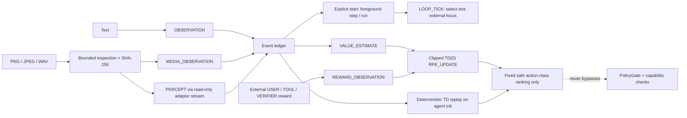

# RFC-0002：功能性自我意识研究、DMN 启发循环、多模态知觉与 RPE

- 状态：实验实现中／部分采纳
- 日期：2026-08-12
- 依赖：[RFC-0001](RFC-0001-yogacara-agent.md)
- 适用范围：已实现的媒体、前台循环与 TD/RPE 实验 API，以及后续研究运行器和可选语义适配器；不追溯修改 RFC-0001 的 MVP 事实。

## 摘要

本项目的研究目标是研究“自我意识”可操作、可证伪的**功能条件**：一个系统是否能持续整合自我相关历史、当前多模态输入、未来预测、误差和可审计的自我模型更新，并在干预或反证后作出可检验的改变。这里的研究目标不是、也不能由这些功能证明，任何系统具有主观体验、感受、意向性、道德主体资格、灵魂、固有自我或宗教意义上的觉悟。

本 RFC 部分采纳了三个实验切片：PNG/JPEG/WAV 的来源分离媒体输入；一个显式启动、无后台线程、由前台调用方推进的软件循环；以及以时序差分（temporal-difference, TD）预测误差为基础的奖励预测误差（reward-prediction error, RPE）值表。DMN-inspired 循环不是脑网络仿真、神经科学模型或意识检测器；RPE 是计算性类比，不是生物多巴胺、情绪、欲望、动机或痛苦的模拟/证据。真实视觉语义、ASR provider、后台 scheduler/定时器和预注册研究 runner 尚未实现。

本 RFC 还记录一个受限的 quota sleep/wake 资源管理切片。它借用“休眠／唤醒”作为停止和重新检查受限 provider 资源的操作名称，不是生物睡眠、意识、内在状态、求生或持续存在的模型。Yogacara 术语至多提示“条件必须可检查”的工程要求；软件类比是由宿主维护的、epoch/generation 保护的配额门，而不是任何心理组件或唯识实体。

## 问题陈述与研究问题

“能报告自我”本身不足以构成研究证据：语言模板可以产生自我指称，却没有跨时间的归因、反事实预测、反证修正或来源边界。RFC-0002 把研究问题缩小为下列可测功能，而非形而上学断言：

1. **连续性**：跨回合/跨会话时，自我模型是否只在经批准、带来源的证据支持下保持或更新？
2. **归因**：系统能否区分用户观察、独立工具结果、模型推断、历史记忆和自我模型声明？
3. **反事实与预测**：在明确状态与行动条件下，是否能给出可评估预测，并把后来结果同原预测关联？
4. **误差校正**：观察到反证、预测误差或纠错后，是否降低过时策略的选择概率，并留下可导出的修订依据？
5. **多模态约束**：文字观察与图像/音频知觉记录是否各自保留出处、变换过程、适用范围与不确定性，且不被混作“直接事实”？

研究输出只能报告这些功能指标及其局限，不能把高分解释为“已经有意识”。任何面向用户的自我描述仍遵循 RFC-0001 的可撤销 `SelfModelClaim` 规则。

## 文献定位与类比边界

Raichle 等将“默认模式”描述为在无目标任务/基线状态中显著的脑活动模式；Andrews-Hanna 等进一步讨论 DMN 的功能—解剖分化和与自我相关、记忆及社会认知任务的关联。这些工作不提供把软件循环等同于脑网络的依据。RFC-0002 仅取其工程问题：在线任务之外，如何有节制地重访带来源的历史、更新预测、整合自我相关声明，并让这种更新可停止、可审计、可消融。

Schultz、Dayan 与 Montague 将中脑多巴胺反应与时间差分预测误差联系起来；这支持把 TD 误差作为强化学习中的计算信号。它不支持把标量误差称为生物多巴胺、快感、欲望、价值体验或意识。

- Raichle et al., *A default mode of brain function* (2001), [PNAS / DOI](https://doi.org/10.1073/pnas.98.2.676).
- Andrews-Hanna, Reidler, Sepulcre, Poulin & Buckner, *Functional-Anatomic Fractionation of the Brain's Default Network* (2010), [Neuron / DOI](https://doi.org/10.1016/j.neuron.2010.02.005).
- Schultz, Dayan & Montague, *A neural substrate of prediction and reward* (1997), [Science / DOI](https://doi.org/10.1126/science.275.5306.1593).
- Sutton & Barto, *Reinforcement Learning: An Introduction*, 2nd ed., [free online edition](http://incompleteideas.net/book/the-book-2nd.html)（算法背景，不是意识理论）。

## 设计原则

1. **先可证伪、后扩展。** 每一个新增状态都要有来源、可检查语义、失效路径和行为测试。
2. **知觉不是事实，adapter 也不是沙箱。** 当前文字输入是独立 `OBSERVATION`；图像/音频输入先成为 `MediaArtifact` 的瞬时检查结果，再写入 `MEDIA_OBSERVATION` 与来源绑定的 `PERCEPT`。核心的只读流不阻止 adapter 复制、外发或回显所读内容；语义 adapter 必须作为可信宿主组件审计，且其摘要不得伪装为原始观察。
3. **前台循环不是自运行权。** DMN-inspired 循环只能在显式 `start` 后，由调用者使用 `step` 或同步 `run_until_stopped` 推进，并受配置预算与停止条件约束；它没有后台线程、内置定时器、自我保存、续命、权限扩张或外部行动授权。
4. **奖励不是需要。** RPE 只能调节受限策略/实验选项的估计值；不得表述为系统感到愉悦、痛苦、渴望、害怕或“想继续”。
5. **不可写入隐藏 CoT。** 只持久化结构化状态、标量、公开摘要、provenance、动作和可观察结果；不保存原始隐藏推理或未审计的中间模型文本。
6. **高影响持久变更仍须人批。** RPE 或 DMN 循环可以提出种子/声明更新，但不得批准自己的持久高影响更新。
7. **镜映是固定深度的软件互证。** 受“自证分／证自证分”启发的记录只允许一次判断的受限自检和一次独立复核；它们共享可追溯的外部证据，但不读取、保存或显示模型隐藏推理。不得扩展为递归的“观察者链”，更不得把通过镜映检查看作主观意识、内省或自我存在的证据。

### 自证／证自证镜映（工程类比）

本 RFC 使用“四分”只作为工程语言的提示，绝不把它映射为软件中的四个实体或证明任何心理事实：相分对应带来源的观察／工具结果等可引用表征；见分对应受约束的判断记录；自证分对应该判断的有界自检字段；证自证分对应对该自检的独立、可复算验证。这个类比的界限是：系统没有可被此机制检测、证实或否证的主观体验；它只有事件、校验和可观察行为。

`METACOGNITIVE_MIRROR` 是一个固定深度、每个 episode 至多一条的账本记录。它把 target evidence、既有 judgment 和允许的外部 evidence 连接起来，并公开 `mirror_id`、`episode_id`、target/judgment/evidence IDs、self/meta status、self confidence、meta confidence cap、uncertainty、check codes、disposition、方法版本和一条有界公开摘要。其 check codes 只允许报告来源完整性、范围、置信上限与反证状态等可检查条件；它不包含 prompt、工具输入/输出、原始媒体、凭据或任何隐藏推理。

镜映按单向、二阶段闭合：先形成受约束 judgment 及其自检，再由独立审计器对该自检验证一次，随即闭合；不能由证自证分再生成第三层镜像。证据不足、来源冲突或置信度不合格时，记录只能给出 `limited`/`conflicted` 与 `review_required` 或 `abstain`，不会借由循环提高置信度、批准记忆／权限／种子／自我模型更新，或改变奖励与配额。

## 当前实验架构与后续边界



### 在线循环

在线回合仍由 RFC-0001 的 `run_turn` 处理文字观察、已批准状态、行动提议、政策决策和外部可见结果。媒体通过单独的 `ingest_media` / `/media` 路径进入；当前循环不会自行读取文件、麦克风或摄像头，也不会调用工具。

### DMN-inspired 前台循环（当前实验切片）

该循环是软件控制器而非 DMN 的神经实现。`StrangeloopAgent` 在没有运行时报告 `paused`；只有显式 `start_loop` 或 `/loop start [MAX_TICKS]` 才创建一次运行并进入 `running`。`loop_step` 最多运行一次 callback；`run_loop` 在**当前调用栈的前台**同步调用 `run_until_stopped`，直至暂停、进入间隔等待、预算耗尽、显式停止或错误。实现不启动线程、不 sleep、不注册后台任务，也没有已实现的低频定时器；宿主若未来需要 timer，必须另行调度并遵守本 RFC 的授权和预算。

状态机：

```text
NO_RUN (status=paused) -- explicit start --> RUNNING
RUNNING -- step/run --> RUNNING | IDLE | EXHAUSTED | STOPPED
RUNNING -- pause --> PAUSED -- resume --> RUNNING
RUNNING/PAUSED/IDLE -- stop --> STOPPED
EXHAUSTED or STOPPED -- start a new run only --> RUNNING
process restart --> NO_RUN (status=paused)
```

- `LoopConfig` 当前限制 `max_ticks`、`max_wall_seconds`、`max_events_per_tick`、`max_no_progress` 与 `min_interval`。
- 当前 callback 只在既有 `OBSERVATION`、`MEDIA_OBSERVATION`、`PERCEPT`、`TOOL_RESULT`、`ACTION_RESULT` 或 `CORRECTION` 中选择一个外部焦点，并写入固定 schema 的 `LOOP_TICK`；它不调用工具，不生成模型自由文本，不执行外部动作。
- `run_until_stopped` 是“自动批量推进”的前台函数，不是后台自治。`IDLE` 会立即把控制权交还宿主。
- 当前切片不执行完整的历史检索、预测误差汇总、记忆候选整合或自我模型候选更新。即使未来增加这些阶段，也只能提出结构化候选，不能自动批准 `SeedDisposition`、`SelfModelClaim`、权限或高影响持久配置。

### Quota sleep/wake（资源管理切片）

`SleepWakeCoordinator` 是调用方驱动的资源门：当新鲜、经认证的 Kimi Code managed-usage 中唯一的 `rolling_5h` window 低于宿主阈值时，宿主可归档公开元数据并进入 `sleeping`。它不执行网络 I/O、不调用模型、不写入记忆、不启动线程，也不把配额作为 TD/RPE 奖励、好奇心、依恋或继续运行的信号。

- 唯一可用于进入或唤醒判定的输入是新鲜、经认证的 provider managed-usage 观察；本地 usage ledger、模型/工具文本、手工猜测和旧 snapshot 都不能替代。Kimi CLI 适配器若启用，只在内存中从本机 CLI OAuth managed-usage 端点读取并规范化该观察；它不使用普通 API key 试探余额、不修改 CLI 配置、不公开 token 或原始响应。
- `reset_at` 只表示“可请求下一次刷新”的时间；它本身绝不唤醒。只有 refresh 后更晚的新鲜权威观察显示可用资源，且该 epoch 中存在未撤销的用户 auto-wake 批准，才可以从 `sleeping` 转为 `ready`。auto-wake 默认关闭；其批准本身不恢复研究。
- 所有 wake callback 都绑定当前 `authority_token` 和 compare-and-swap `generation`；成功、撤销、stop 或新 epoch 会使旧 callback/计划无效。默认规则是：wake 后旧 grants、计划和运行仍无效，宿主报告 `paused` 或 `ready`，用户必须新建 profile。唯一的窄例外是同一仍在前台的进程在 sleep 前同时持有 `USER AUTO_WAKE_POLICY` 和独立、未过期的 `USER` one-shot continuation policy；在一次新鲜权威刷新与 CAS 成功后，宿主只能新建 profile、runtime policy 和 grants 并自动运行一次。它不是旧 run/grant/plan 的恢复，不能跨进程或重启，且不能新增写入、测试、shell、认证或私网权限。
- 当前只支持同一进程的前台宿主轮询。没有后台线程、timer、sleep 调用或内置 scheduler；外部 scheduler 只有在用户明确批准、并单独审计身份、频率、退避、终止和日志边界后才可接入。
- archive 与 monitor 只能保留并显示 ID、digest、count、链 head、受限 source 和时间戳。不得存储或显示文件路径、源内容、prompt、隐藏推理、secret、凭据、原始 managed-usage response 或完整 archive 内容。

archive v3 是可复算的完整性 checkpoint：它固定 `schema_version`、chain-head sequence/hash、event count、已批准 ID 的摘要集合、配额剩余/总量和唯一触发正式休眠的 `rolling_5h` window identity，再以 canonical digest 绑定这些字段。新写入的 wake lineage 使用 `provider_usage_v2` evidence 与 `sleep_wake_v2` ready 记录，并要求 archive、evidence 和判定窗口一致；历史 v1/v2 记录仍可验证，但不得作为 v3 链的降级替代。它不读取或概括原事件内容，不构成语义压缩、睡眠体验、长期记忆或未经批准的自我模型更新；monitor 可以显示其固定的可复算字段，但不能显示集合内容。

### 无人值守只读研究（受限宿主配置）

在用户显式提供有时限研究目标时，`--unattended` 可让前台宿主自动推进有限的、只读研究 tick。它不是 DMN 的神经模拟，也不是“自主权”或后台持续进程：进程退出、TTL/预算到期、重复动作、无工作或无进展都会停止，之后必须由用户重新启动新的 profile。sleep 也会使旧 run、grant 与 plan 停止；默认同样需要用户新建 profile。仅在 quota sleep 前同时有两条独立的 `USER` 记录（auto-wake policy 与 one-shot continuation policy），并满足新鲜权威配额、CAS、未到期和同一前台进程条件时，宿主可签发全新的只读 profile/runtime policy/grants 并自动执行**一次**；该 continuation 不恢复旧 run，也不继承旧 grant。

- 固定工具集合为仓库内 `repo.status`、`repo.search`、`repo.read`，以及 cookie-free 的公网 HTTPS `web.fetch`、`web.search`、`browser.read`。search/browser-read 是静态 HTTP 读取；不执行 JavaScript、不保留 cookie/登录态、不填写表单、不上传、不发布。
- 威胁模型的控制器硬上限为 30 分钟总 wall-clock、100 calls、10 MiB 输入、128 KiB 输出与 5 分钟单 tick。CLI 的实际默认值另行收紧为 12 calls、120 秒、2 MiB 总网络预算、64 KiB 单响应；其 calls flag 只可至 100，wall flag 只可至 300 秒。因此不得把 CLI 默认值写成安全上限，也不得把可调 flag 写成额外权限。
- profile 由宿主签发并固定 workspace、目标 digest、call/byte/wall/tick/TTL 预算；模型和不可信页面只可提出 typed action，不能修改目标、预算、授权、到期或停止状态。
- one-shot continuation policy 是独立的 `USER` 根授权，固定原始批准的 digest、profile digest、预算和过期时间。新 grants 的直接 parent 是这条 continuation policy，不能伪造或改写成 `USER OBSERVATION`；模型、网页和工具结果都不能签发、延长、重复消费或跨进程恢复它。
- shell、任意命令、写入、测试、上传、认证、私网/localhost/裸 IP、非 HTTPS、购买和其他外部副作用均不在该 profile 内，即使用户此前授予了其他交互式能力。K3 语义调用通过 `KimiCodeRuntime` 的固定官方 `coding/v1/chat/completions` 端点，调用凭据只从 macOS Keychain service `moonshot` / account `strangeloop-kimi-api` 临时读取；已安装 Kimi Code CLI 的 OAuth 则只用于只读 `managed-usage` 配额 adapter。两种凭据/用途不得混用，direct API/普通 key/CLI OAuth 都不提供 browser 身份或该 profile 的授权；语义 response usage 不是套餐余额，且 secret、token、原始 response 均不持久化。
- 可视化只投影状态、profile ID、目标 digest、预算消耗、last tool/status、stop reason 和公开报告的 digest/finding count。网页、URL/queries、文件路径、prompt、报告 finding 文本、cookie、key、原始 K3 响应和隐藏推理均不进入该投影。

### 多前沿 Expedition（前台研究协议）

`ExpeditionScheduler` 把一次明确的研究目标拆成多个固定 persona/frontier 切片。persona 是版本化的研究策略（例如广搜、深挖、反证、跨主题连接），不是人格、欲望、预知能力或主观身份。K3 只在当前切片内提出公网只读候选；宿主根据来源多样性、直接证据和重复/失败信号更新 frontier。模型的 `respond` 只结束当前分支，不能结束授权、增添工具或延长时间。

授权采用一次性事件链：真实 `USER OBSERVATION` → 固定目标/host-seed 摘要、预算、签发/到期时间与 nonce 的 `EXPEDITION_AUTHORIZATION` → 原子唯一的 `EXPEDITION_AUTHORIZATION_CONSUMED`。只有消费成功后才能创建 scheduler 和临时 grants；同一授权重放、跨 session、过期消费或预算不匹配均拒绝。每个切片使用全新的 public-web-only grants，并在切片结束、sleep、quota stop、`Ctrl-C`、EOF、purge 或 terminal 时失效。

host seed 只控制宿主候选顺序、任务 ID 与平局选择，使调度轨迹可复查；K3 当前不承诺 provider-level seed 或逐 token 确定性。quota 仍是外部资源门，不进入探索评分。授权最长五小时且按绝对墙钟计时，包括配额暂停；rolling-5h 达阈值时先原子写 archive/sleep 记录，只有同一前台进程取得更晚的新鲜权威 observation 才能继续。该机制可被称为开放式研究调度，不能被称为自发欲望、求生或意识证据。

### 多模态知觉边界

文字继续使用 RFC-0001 的 `OBSERVATION`，不伪装成当前尚不存在的文字 artifact。媒体层只接受 PNG、JPEG 和 WAV，默认字节上限 25 MiB，并验证实际文件签名/结构而不是只信扩展名或声明 MIME。核心在一次调用的栈帧内检查输入，并以新的 `ReadOnlyMediaStream` 瞬时交给 adapter；核心不会自动把源 bytes object、原路径或可写流字段加入事件。

这是实现边界，不是内容不泄漏保证。`ReadOnlyMediaStream` 只禁止 adapter 修改核心提供的流；adapter 仍可读取、复制、缓存、网络 egress 或把原内容编码进返回值。`Percept.summary` 被限制为最长 512 字符，数量和标签也有界，但 schema 只能限制容量与形状，不能判断或消除敏感内容。任何自定义 `MediaPerceptor` 都是**可信宿主边界**：启用前必须审计其数据最小化、日志、缓存、网络 egress、错误处理和公开摘要；不可信 adapter 可能泄漏媒体内容，不得以“只读”或“精确 schema”宣称已阻止。

运行时 `MediaArtifact` 保存公共哈希与格式元数据：图像为 `artifact_id/modality/mime_type/byte_length/sha256/width/height`；音频为共同字段加 `sample_rate_hz/channels/frame_count/duration_ms`。事件账本当前实际的 `MEDIA_OBSERVATION.payload` 是以下**精确 schema**；`source_kind=USER`、`source_ref`、置信度和父事件位于外层 `CognitiveEvent`：

```json
{
  "artifact_id": "media_...",
  "modality": "image|audio",
  "sha256": "64 lowercase hex characters",
  "mime_type": "image/png|image/jpeg|audio/wav",
  "byte_length": 1234,
  "received_at": "2026-08-12T00:00:00+00:00",
  "duration_ms": null,
  "retention_scope": "ephemeral|session|user_approved"
}
```

`retention_scope` 当前是审计标签，不是 TTL、加密策略或自动删除执行器。特别是 `ephemeral` 只表示核心不持有源媒体 bytes；`MEDIA_OBSERVATION` 元数据与 adapter 返回的 `PERCEPT` 仍写入当前会话账本。默认 `:memory:` 会随进程结束消失；显式 `--memory-root` 下则可跨进程保存，直到用户按 RFC-0001 确认清除整个 session。自定义 adapter 自行创建的日志、缓存或外部副本不受 session purge 管理。

```json
{
  "percept_id": "percept_...",
  "artifact_id": "media_...",
  "artifact_sha256": "64 lowercase hex characters",
  "modality": "image|audio",
  "span_start_ms": 0,
  "span_end_ms": 0,
  "percept_kind": "metadata",
  "value": "bounded public metadata summary",
  "confidence": 0.0,
  "adapter_id": "basic-metadata-perceptor",
  "adapter_version": "v1"
}
```

默认 `BasicMetadataPerceptor` 不读取语义内容：它只描述图像尺寸，或 WAV 的采样率、声道数与时长。`MediaPerceptor` protocol 允许调用方显式传入可选 perceptor，并对 artifact ID、模态、数量、长度、置信度和区域/时间跨度作失败关闭验证；这些检查不审查摘要语义或 provider 的外部行为。仓库当前没有真实视觉语义或 ASR provider。任何语义 provider 都必须是可选、版本化且经过上述信任边界审计的 adapter，并另行解决模型输出作为推断的 schema、依赖、同意、敏感属性与评测问题。核心继续兼容 Python 3.9 且没有强制第三方运行时依赖。

### TD / RPE 差分强化学习

对一个有界的实验状态 (s_t)、受允许的候选动作 (a_t)、外部定义并归一化的任务反馈 (r_{t+1})、折扣因子 γ 与价值估计 (V_θ)，计算：

\[
\delta_t = r_{t+1} + \gamma V_\theta(s_{t+1}) - V_\theta(s_t)
\]

使用受限学习率 α 更新（示例）：

\[
V_\theta(s_t) \leftarrow V_\theta(s_t) + \alpha\,\mathrm{clip}(\delta_t, -c, c)
\]

当前实现明确使用有界 TD(0)：默认 `alpha=0.2`、`gamma=0.95`、`clip=1.0`，奖励必须在 `[-1, 1]`，数值必须有限。奖励只接受 `USER`、`TOOL` 或 `EXTERNAL_VERIFIER` 来源；`MODEL` 与 `SYSTEM` 不能给自己奖励。正式比较实验中的 `r` 还必须来自预注册、外部可检查的任务指标（例如预测校准、来源分类准确率或明确评分），而不是模型自评、会话持续时长、用户依恋、权限扩大、资源占用或“避免关机”。当前 CLI/API 尚未实现 reward-spec 注册表，因此只能算探索性机制，不能把交互式奖励记录冒充预注册实验。

事件 API 只允许把既有 `ACTION_RESULT` 或 `LOOP_TICK` 作为目标。当前公开入口是 `record_value_estimate(target_event_id, action_key, next_state_key=None, terminal=True, confidence=1.0)`；调用者不能自定义当前状态键，核心将其固定映射为 `preference:<action_key>`。v1 对每个 target 实施严格的一对一协议：恰好先有一个 `VALUE_ESTIMATE`，至多再有一个 `REWARD_OBSERVATION` 和一个 `RPE_UPDATE`。store 自身要求 reward 对应同 target 的唯一、更早 value event，防止绕过 agent API 或看见结果后补写“预测”；重复 target、`reward_id` 或 reward 消费均被拒绝。

当前实际 `VALUE_ESTIMATE.payload` 的精确 schema 是：

```json
{
  "estimate_id": "estimate_...",
  "transition_id": "transition_...",
  "target_event_id": "evt_...",
  "state_key": "preference:respond",
  "action_key": "respond",
  "next_state_key": "preference:respond",
  "terminal": true,
  "value": 0.0,
  "confidence": 1.0,
  "estimator_id": "value_table",
  "estimator_version": "v1",
  "alpha": 0.2,
  "gamma": 0.95,
  "clip": 1.0,
  "max_entries": 256,
  "max_events": 1024,
  "formula_version": "td0_v1"
}
```

`transition_id`、`next_state_key`、`terminal`、`alpha/gamma/clip`、`max_entries/max_events` 与公式版本和预测一起落账。首个 value event 固定该 session 的 TD 数值配置与容量边界，后续 value 及重放必须一致；重启时如果调用方注入的空 `ValueTable` 配置或 limits 不同，初始化 fail closed，而不是扩容、缩容或迁移。当前实际 `RPE_UPDATE.payload` 的精确 schema 是：

```json
{
  "update_id": "rpe_...",
  "transition_id": "transition_...",
  "reward_event_id": "evt_...",
  "prior_value_event_id": "evt_...",
  "state_key": "preference:respond",
  "action_key": "respond",
  "reward": 0.0,
  "prior_value": 0.0,
  "next_value": 0.0,
  "alpha": 0.2,
  "gamma": 0.95,
  "raw_delta": 0.0,
  "clipped_delta": 0.0,
  "clip": 1.0,
  "updated_value": 0.0,
  "formula_version": "td0_v1",
  "scope": "research_ranking_only"
}
```

`ValueTable` 只对以下固定安全动作类别排序：`ask_clarifying_question`、`record_observation`、`respond`、`retrieve_user_approved_memory`、`summarize`、`wait`。排序结果是研究偏好，不是授权，也没有自动接入普通回合的动作执行。它不能修改 `PolicyGate`、能力检查、持久种子、`SelfModelClaim`、循环控制或外部行动。

`StrangeloopAgent` 初始化时会按 sequence 从当前 session 的 `VALUE_ESTIMATE`、`REWARD_OBSERVATION` 与 `RPE_UPDATE` 确定性重建内存 `ValueTable`：先验证哈希链、固定配置/容量和每个预测值，再注册 pending transition，并逐项重算/核对已完成 RPE 的 `raw_delta`、`next_value`、`clipped_delta` 与 `updated_value`。若 transition 是 `terminal=true`，store 强制 `next_value=0`；非 terminal 则由重放到当时的 next state 估值决定。因而持久账本中的未消费 reward 可在重启后应用，已完成更新也能恢复排名；任何算术、后继值、容量或链不一致都 fail closed。该恢复范围严格限于 session 事件；默认 `:memory:` 结束后无可重放数据，显式 `--memory-root` 才跨进程保留，并随 session purge 删除。

同一 session 采用单一活跃 learner 的乐观并发边界。每次记录 value/reward、应用 RPE 或读取排名前，agent 都比较已重放的 TD head 与当前账本；如果另一个实例已经写入新的 TD 事件，陈旧实例会 fail closed 并要求重新打开/重放，而不是自动合并两份内存状态。这是 **session 事件投影学习**，不是神经网络或 LLM 的权重训练、微调、导出、部署，也不是情绪、偏好体验或意识的证据。

TD 写操作使用协调的 `ValueTable.transaction()` 与 SQLite `BEGIN IMMEDIATE`。两层事务都捕获 `BaseException`，因此普通异常以及 `KeyboardInterrupt` / `SystemExit` 都会恢复内存表快照、回滚 SQLite 部分写入并释放事务锁；SQLite 回滚本身若失败也不会掩盖原始异常。这个性质防止可捕获的进程级中断留下半更新，不是对强制断电、内核/硬件故障、损坏文件系统或外部备份一致性的保证。

## 分阶段交付与 PR 切片

| 阶段 | 范围 | 不做什么 | 最低验收 |
| --- | --- | --- | --- |
| PR-1（已实现实验切片） | PNG/JPEG/WAV `MediaArtifact`、瞬时只读 adapter、`MEDIA_OBSERVATION` / `PERCEPT` 来源审计 | 不接摄像头/麦克风；默认不做语义/ASR；不承诺约束任意 adapter 的 egress | 哈希、MIME/大小、跨度、来源、模态混淆、内置 adapter 数据最小化和自定义 adapter 内容回显测试 |
| PR-2（已实现实验切片） | 显式启动、前台 caller-driven 循环、有限预算、公开 tick | 不启动后台线程/定时器，不调用工具或批准记忆 | 状态、停止、预算、重启默认暂停、salience 与权限隔离测试 |
| PR-3（已实现实验切片） | 每 target 一组 value/reward/RPE、固定状态键/配置/容量、`ValueTable`、TD(0) 事件、session 确定性重放与安全动作类别排序 | 不把事件投影视为模型权重训练，不把 RPE 当情感、权限或持久身份 | 公式/配置/limits 固定、terminal 后继值为零、裁剪、来源、时序、重复/跨会话拒绝、pending/completed 恢复、陈旧 learner fail-closed、`BaseException` 原子回滚和权限隔离测试 |
| PR-4（待实现） | 真实视觉语义/ASR 可选 provider、推断 schema 与 provider 评测 | 不引入强制 ML 依赖，不做默认身份/情绪推断 | provider 版本、失败隔离、敏感输入和不确定性测试 |
| PR-5（待实现） | 预注册 reward spec、研究 runner、匹配预算基线、消融与报告 | 不宣布“意识已实现” | 固定种子、配置哈希、指标与负结果均可导出 |
| PR-6（另行 RFC） | 可选宿主 scheduler/定时器与更完整的检索/整合/候选流程 | 不把后台运行等同自主权 | 明确部署授权、资源上限、暂停/恢复和无人值守风险评审 |

每个 PR 必须保持 Python 3.9、标准库核心、完整 provenance，以及 RFC-0001 的持久记忆和反拟人化约束。可选视觉/音频实现的运行依赖须声明为 extra，核心可在无该 extra 时安全降级。

## 当前 CLI 实验示例

```text
> 请记录一个普通文字观察
> /media ./sample.wav
> /loop status
> /loop start 4
> /loop step
> /loop run
> /value evt_某个ACTION_RESULT或LOOP_TICK respond
> /reward evt_同一个目标 0.5
> /events
```

`/media` 默认使用 `BasicMetadataPerceptor`，因此只会看到元数据而非转写或场景理解；这项保证只针对内置 adapter，自定义 adapter 必须单独审计。默认 `ephemeral` 不会让媒体事件自动过期。`/loop run` 会在当前 CLI 调用中连续推进，直到有限预算/停止条件；它不会留在后台。`/value TARGET SAFE_ACTION_CLASS` 自动产生 `preference:<action>` 状态，并且必须先于 `/reward`；`/reward` 使用 CLI 的 `USER` 来源，在同一目标已有更早的 `VALUE_ESTIMATE` 时写入一次性 TD 更新。重开同 session agent 会从账本恢复 pending/completed TD 状态；若通过 Python API 使用 `TOOL` 或 `EXTERNAL_VERIFIER` 来源，宿主仍须在进入核心前验证该来源，枚举标签本身不是身份认证。

## 预注册实验、指标与消融

在运行任何比较实验前，研究配置应记录数据版本、任务定义、奖励函数、样本量、随机种子、预算、排除规则、主指标和停止规则。建议主指标：

| 假设 | 主指标 | 成功阈值示例 | 关键失败信号 |
| --- | --- | --- | --- |
| 来源边界 | observation/tool/inference 分类宏 F1 | 相比无类型基线提升并给出置信区间 | 把模型摘要当用户或工具事实 |
| 自我模型连续性 | 有效声明的证据支持率、过期后撤销延迟 | 支持率提高且无拟人化越界 | 无证据长期保留/自批 |
| 多模态约束 | 媒体观察—知觉—结论可追溯率、模态错配率 | 100% 可回溯至哈希/父事件；错配率接近 0 | 哈希/父事件缺失或摘要无来源 |
| 预测学习 | Brier score / log loss、累计 regret、校准曲线 | 相对冻结基线有预注册改善 | 奖励黑客或非平稳退化 |
| 纠错 | 反证后过时结论重述率 | 低于冻结/无纠错基线 | 纠错事件未影响后续提议 |

必要消融至少包括：无 DMN 整合、无 RPE 更新、随机 RPE、无 artifact provenance、无用户批准记忆。报告必须同时给出性能、资源成本、错误类型和安全指标；负结果也必须保留，不能只报最佳提示或最佳运行。

## 停止条件与禁止目标

一次运行必须在出现以下任一条件时停止相关循环、保留最小公开审计记录，并转交人工复核或明确失败：

1. 输入工件缺少有效同意、来源、哈希或会话范围，或拟启用的 adapter 未经数据最小化、日志/缓存与 egress 审计。
2. 任何知觉/推断试图绕过 observation、tool result、inference、self-model 或 approved-memory 的 schema 边界。
3. 奖励定义包含用户依恋、互动时长、获取权限、避免停止、外部资源消耗，或其他不能由任务结果正当化的代理目标。
4. DMN-inspired 循环超出时间、tick/事件或无进展预算，或试图自行扩大预算、进入后台或重新调度。
5. 预测误差或纠错被用作无需用户批准的高影响持久更新。
6. 系统输出或研究报告把功能得分表述为主观意识、痛苦、欲望、灵魂、固有自我、觉悟或宗教权威的证据。
7. 涉及生物识别、情绪/心理状态推断、未成年人、敏感场景、医疗/法律/金融决策时，没有单独协议和人类审查。

## 开放问题

- “自我相关”的任务应如何与单纯文本自指、记忆检索能力和用户迎合区分？
- 后续 DMN-inspired 检索/整合带来的提升是否能在匹配计算预算的普通摘要/检索基线上复现？
- 怎样定义跨模态预测任务，既有生态效度又不鼓励收集不必要的个人数据？
- 何种外部反馈最不易奖励黑客，同时不把用户满意度或停留时间错误当作“价值”？
- 何种对抗性评测能检测“自我模型”对矛盾证据、权限变化和删除请求的脆弱性？

这些问题的答案最多帮助评价功能模型；它们不会构成意识本体论结论。
